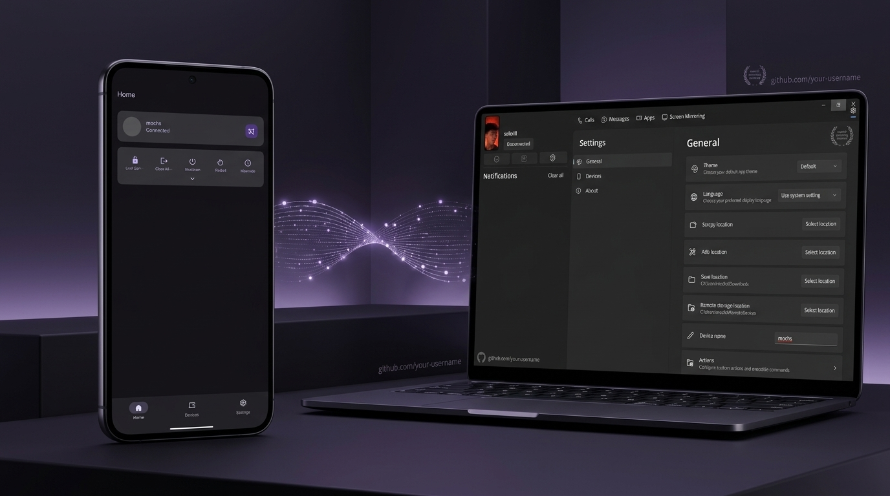
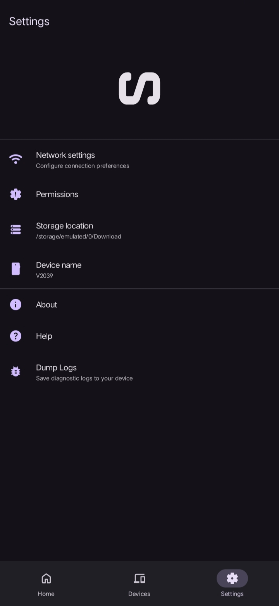

<div align="center">



# FlowLink Desktop

Native Windows app to connect your PC with your Android phone.

[](https://github.com/saferill/Flowlink-Android)
[-0078d4?style=flat-square&logo=windows&logoColor=white)](https://github.com/saferill/Flowlink-Desktop)
[](https://dotnet.microsoft.com)
[](LICENSE)

<br/>

Built with WinUI 3 and .NET 9. Send files, sync clipboard automatically, and execute PC remote power actions from your phone over local Wi-Fi or Tailscale.

</div>

---

## Screenshots

<div align="center">

### Windows App


### Android Mobile Companion
| Home | Devices | Settings |
| :---: | :---: | :---: |
|  |  |  |

</div>

---

## Download

Install FlowLink on both your Windows PC and your Android phone.

| Platform | Download | Note |
| :--- | :--- | :--- |
| 💻 **Windows PC** | [**FlowLink Setup (.exe)**](https://github.com/saferill/Flowlink-Desktop/releases/latest) <br/> [**Portable (.zip)**](https://github.com/saferill/Flowlink-Desktop/releases/latest) | Windows 10 & 11 (x64) |
| 📱 **Android** | [**Download APK (v1.0.0)**](https://github.com/saferill/Flowlink-Android/releases/latest) | Android 8.0+ |

---

## Features

- **Fast File Transfer**: Direct peer-to-peer file transfer over your local network.
- **Instant Clipboard Sync**: Copies on your PC appear immediately on your phone, and vice-versa.
- **Power Actions**: Lock, sleep, or shutdown your PC triggered directly from Android.
- **System Tray & Autostart**: Minimizes cleanly to the system tray and starts on Windows boot.
- **Works with Tailscale**: Seamless discovery across different subnets.

---

## How it works

<div align="center">
  
</div>

---

## Building from source

Requirements:
- Windows 10/11
- .NET 9 SDK
- Visual Studio 2022 with Windows App SDK

```powershell
git clone https://github.com/saferill/Flowlink-Desktop.git
cd Flowlink-Desktop
dotnet build -c Release
```

---

## License

This project is licensed under the **[GNU General Public License v3.0 (GPL-3.0)](LICENSE)**.
Created by **[saferill](https://github.com/saferill)**.

