<div align="center">


# 💻 FlowLink Desktop

### *The Lightweight, Native Windows Companion for Seamless Device Integration*

[](https://github.com/saferill/Flowlink-Android)
[-0078d4?style=for-the-badge&logo=windows&logoColor=white)](https://github.com/saferill/Flowlink-Desktop)
[](https://dotnet.microsoft.com)
[](LICENSE)

<br/>

**FlowLink Desktop** is a modern, high-performance WinUI 3 application designed to seamlessly bridge your Windows PC with your Android smartphone. Experience **zero-latency real-time clipboard sync**, **encrypted peer-to-peer file transfers**, and **instant PC power controls** without third-party cloud servers.

</div>

---

## 📸 Tampilan Aplikasi (App Screenshots)

<div align="center">

### 💻 Antarmuka Windows Desktop


### 📱 Pasangan Android Mobile
| Beranda & Remote Control | Manajemen Perangkat | Pengaturan Android |
| :---: | :---: | :---: |
|  |  |  |

</div>

---

## 📥 Download FlowLink (Both Devices Required)

> 💡 **Penting**: Untuk menghubungkan perangkat, pasang FlowLink di laptop/PC Windows **DAN** di smartphone Android kamu.

| Platform | Download Link | Deskripsi / Format |
| :--- | :--- | :--- |
| 💻 **Windows PC** | 📥 [**FlowLink Desktop Setup (.exe)**](https://github.com/saferill/Flowlink-Desktop/releases/latest) <br><br> 🗜️ [**FlowLink Desktop Portable (.zip)**](https://github.com/saferill/Flowlink-Desktop/releases/latest) | Installer resmi dengan update otomatis, atau versi Portable tanpa instalasi (Windows 10/11) |
| 📱 **Android** | 📦 [**Download FlowLink APK (v1.0.0)**](https://github.com/saferill/Flowlink-Android/releases/latest) <br> *(Pengajuan IzzyOnDroid / F-Droid sedang dalam peninjauan)* | File APK resmi (Android 8.0+) |

---

## 🔗 Repositori Resmi
* 💻 **Windows Desktop Repo**: [saferill/Flowlink-Desktop](https://github.com/saferill/Flowlink-Desktop)
* 📱 **Android App Repo**: [saferill/Flowlink-Android](https://github.com/saferill/Flowlink-Android)

---

## 🌟 Arsitektur & Cara Kerja

Open the interactive simulation in your browser:  
👉 **[`architecture.html`](./architecture.html)** *(Interactive motion flow, live packet simulator, and real-time signal waveforms)*

```mermaid
flowchart LR
    subgraph DESKTOP["💻 FlowLink Desktop (WinUI 3 / .NET 9)"]
        direction TB
        D1["🔄 Silent System Tray Autostart (Boot / Restart)"]
        D2["⏱️ Adaptive 2s Fast Polling Discovery Loop"]
        D3["🖱️ Explorer Context Menu ('Send to Phone')"]
        D4["⚡ Native Win32 API Execution (0ms Response)"]
    end

    subgraph MESH["🌐 Encrypted WireGuard / TLS 1.3 Mesh"]
        direction TB
        M1["TCP NoDelay (Nagle Disabled)"]
        M2["2MB Socket Windows"]
        M3["Zero-Latency Stream Pipeline"]
    end

    subgraph ANDROID["📱 FlowLink Android (Kotlin / Compose)"]
        direction TB
        A1["🚀 Network Discovery (mDNS & Tailscale CGNAT)"]
        A2["⚡ Adaptive Buffer Stream (64KB ➔ 4MB Chunks)"]
        A3["🔒 Device Control Card (Lock, Close All Apps, Shutdown)"]
        A4["📋 Clipboard & Notification Mirroring (E2EE)"]
    end

    DESKTOP <===>|"Encrypted Sockets (Port 5149–5169)"| MESH
    MESH <===>|"High-Throughput IO"| ANDROID
```



---

## 🚀 Fitur Unggulan

### 1. ⚡ Transfer File Super Cepat
- Menggunakan socket buffer adaptif (hingga 4 MB mega-chunk) untuk transfer video 4K dan foto berukuran besar di jaringan Wi-Fi lokal dengan kecepatan maksimal.

### 2. 📋 Sinkronisasi Clipboard Instan
- Salin teks di laptop, langsung tempel (*paste*) di smartphone Android, begitu juga sebaliknya.

### 3. ⏱️ Auto-Reconnect 2 Detik Setelah Laptop Nyala / Restart
- FlowLink Desktop secara cerdas mencoba menyambung ulang setiap 2 detik ke IP HP kamu (baik Wi-Fi lokal maupun Tailscale) begitu laptop dihidupkan.

### 4. 🔒 100% Aman & Peer-to-Peer
- Seluruh komunikasi data dienkripsi langsung antar-perangkat (*End-to-End Encryption*) tanpa perantara server pihak ketiga.

---

## 🛠️ Build dari Source Code

```bash
# Clone repository
git clone https://github.com/saferill/Flowlink-Desktop.git
cd Flowlink-Desktop

# Publish Release
dotnet publish src/FlowLink/FlowLink.csproj -c Release -r win-x64 --self-contained
```

---

## 📜 Lisensi
Proyek ini dilisensikan di bawah lisensi **[GNU General Public License v3.0 (GPL-3.0)](LICENSE)**.
Dikembangkan dan dirawat secara aktif oleh **[saferill](https://github.com/saferill)**.
