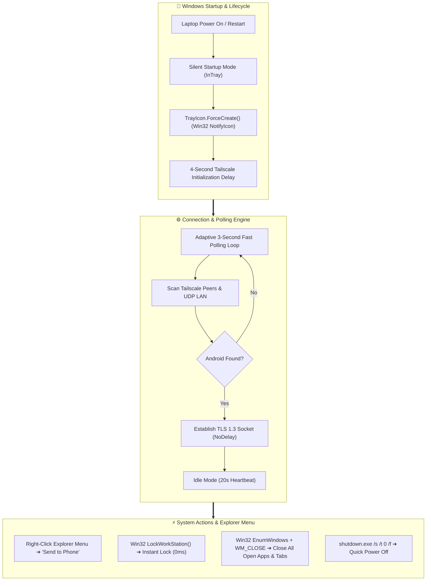

<div align="center">

# 💻 FlowLink Desktop
### *High-Performance Windows Companion for FlowLink Android*

[](https://github.com/saferill/Flowlink-Android)
[](https://github.com/saferill/Flowlink-Desktop)
[](https://dotnet.microsoft.com)
[](LICENSE)

<br/>

**FlowLink Desktop** is a modern, lightweight, native Windows application built with **WinUI 3 and .NET 9**. It bridges your PC with your Android smartphone with **silent startup system tray execution**, **adaptive Tailscale fast polling**, **Windows Explorer right-click integration**, and **zero-latency socket transfers**.

</div>

---

## 🌟 Interactive Live Architecture

Open the interactive simulation in your browser:
👉 **[`architecture.html`](./architecture.html)** *(Interactive motion flow, live packet simulator, and real-time signal waveforms)*



---

## 🚀 Key Desktop Features

### 1. 🪟 Silent System Tray Autostart on Boot / Restart
- Starts seamlessly on Windows boot without opening intrusive windows.
- System tray icon is forced into the taskbar immediately via Win32 `Shell_NotifyIcon`.
- Closing the window minimizes back to the tray so background synchronization never stops.

### 2. ⏱️ Adaptive 3-Second Tailscale Fast Polling
- **Startup Grace Period**: Waits 4 seconds upon boot for Windows network stack & Tailscale daemon to be ready.
- **Fast Auto-Connect**: Searches every **3 seconds** until your Android phone is discovered, establishing connection automatically.
- **Power Efficiency**: Switches to a low-power 20-second heartbeat once connected.

### 3. 🖱️ Windows Explorer Right-Click Context Menu
- Right-click any file, photo, video, or folder in Windows Explorer:
  👉 **"Send to Phone (FlowLink)"**
- Instantly transmits the files to your active phone in milliseconds.

### 4. ⚡ Native Win32 System Power Execution
- **Lock Screen**: Calls `user32.dll` `LockWorkStation()` (0 ms).
- **Close All Apps**: Iterates over top-level windows and sends `WM_CLOSE` to close all browsers, open tabs, and applications cleanly.
- **Shutdown / Restart / Hibernate / Log Off**.

### 5. 🚀 Ultra-Speed Socket Transfers
- Configured with `OptionNoDelay = true` (disables Nagle's algorithm) and **2 MB – 4 MB socket buffers** for maximum wire-speed file throughput.

---

## 🏗️ Project Architecture

```
FlowLink Desktop/
├── src/FlowLink/
│   ├── Assets/Icons/          # High-resolution multi-layer vectors & app tiles
│   ├── Data/                  # Models, Contracts, SQLite repositories
│   ├── Helpers/               # App lifecycle, Windows context menu registration
│   ├── Platforms/Windows/     # Native Win32 services (WindowsActionService)
│   ├── Services/
│   │   ├── DiscoveryService.cs   # Tailscale adaptive polling & UDP discovery
│   │   ├── FileTransfer/         # Adaptive chunk stream engine (64KB–4MB)
│   │   └── Socket/               # Low-latency SocketProvider (NoDelay)
│   ├── UserControls/             # TrayIconControl (Win32 NotifyIcon)
│   └── Views/                    # WinUI 3 pages & dialogs
```

---

## 💻 How to Use

1. **Launch**: Open FlowLink Desktop (or let it launch automatically on startup).
2. **Pairing**: Connect via Wi-Fi LAN or Tailscale. Confirm pairing code on both devices.
3. **Enjoy Zero-Click Continuity**:
   - Copy text on laptop ➔ Pasted instantly on phone.
   - Right-click file ➔ **Send to Phone (FlowLink)**.
   - Control laptop power directly from your Android phone's control card!

---

<div align="center">
  <sub>Built with ❤️ for seamless cross-platform productivity.</sub>
</div>
