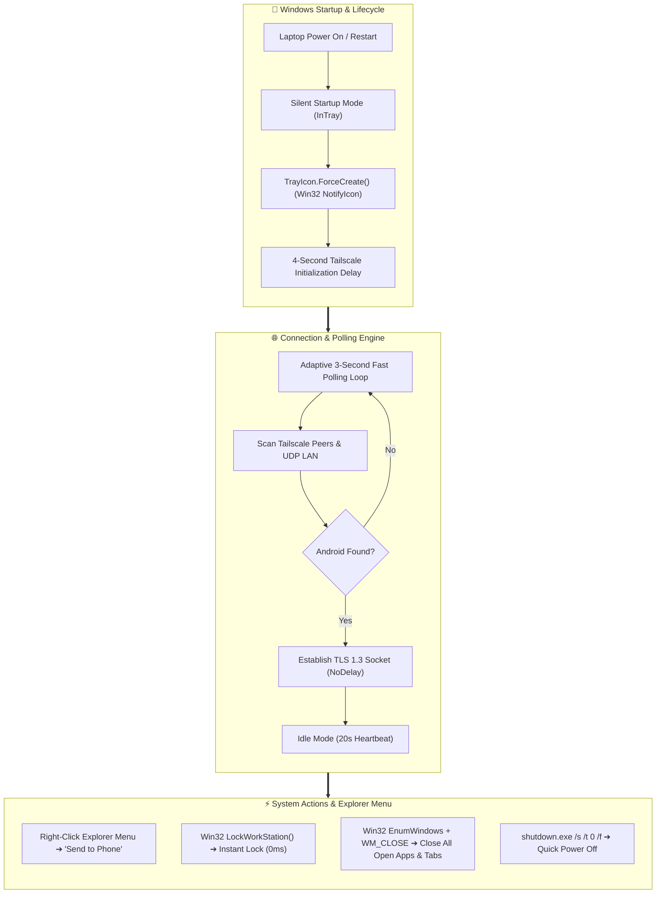

<div align="center">


# ⚡ FlowLink Desktop

### *High-Performance Windows Companion for FlowLink Android*

[](https://github.com/saferill/Flowlink-Android)
[](https://github.com/saferill/Flowlink-Desktop)
[](https://dotnet.microsoft.com)
[](LICENSE)

<br/>

**FlowLink Desktop** is a modern, lightweight, native Windows companion built with **WinUI 3 and .NET 9**. It bridges your PC with your Android smartphone featuring **silent system tray startup**, **adaptive fast network discovery**, **Windows Explorer right-click integration**, and **bi-directional clipboard synchronization**.

</div>

---

## 📥 Download FlowLink (Both Devices Required)

> 💡 **Penting**: Untuk menghubungkan perangkat, pasang FlowLink di laptop/PC Windows **DAN** di smartphone Android kamu.

| Platform | Download Link | Deskripsi / Format |
| :--- | :--- | :--- |
| 💻 **Windows PC** | 📥 [**FlowLink Desktop Setup (.exe)**](https://github.com/saferill/Flowlink-Desktop/releases/latest) <br><br> 🗜️ [**FlowLink Desktop Portable (.zip)**](https://github.com/saferill/Flowlink-Desktop/releases/latest) | Installer resmi dengan shortcut Start Menu & Desktop, atau versi Portable tanpa instalasi (Windows 10/11) |
| 📱 **Android** | [](https://apt.izzysoft.de/fdroid/index/apk/com.castle.FlowLink) <br><br> 📦 [**Download APK Langsung (v1.0.0)**](https://github.com/saferill/Flowlink-Android/releases/latest) | Pasang via F-Droid / IzzyOnDroid untuk update otomatis, atau unduh file APK resmi (Android 8.0+) |

---

## 🔗 Repositori Resmi
* 💻 **Windows Desktop Repo**: [saferill/Flowlink-Desktop](https://github.com/saferill/Flowlink-Desktop)
* 📱 **Android App Repo**: [saferill/Flowlink-Android](https://github.com/saferill/Flowlink-Android)

---

## 🌟 Architecture Overview

Open the interactive simulation in your browser:  
👉 **[`architecture.html`](./architecture.html)** *(Interactive motion flow, live packet simulator, and real-time signal waveforms)*



---

## 🚀 Fitur Unggulan Desktop

### 1. 🪟 Silent System Tray Autostart on Boot / Restart
- Berjalan otomatis di latar belakang (*system tray*) saat Windows menyala tanpa membuka jendela yang mengganggu.
- Ikon tray Win32 dibuat langsung secara responsif.

### 2. 🖱️ Integrasi Menu Klik-Kanan Windows Explorer
- Klik kanan file apa saja di laptop kamu ➔ pilih **"Send to Phone"** untuk langsung mengirim file ke Android tanpa perantara cloud.

### 3. 📋 Sinkronisasi Clipboard Dua Arah
- Teks yang kamu copy di Windows langsung tersedia di clipboard Android dalam hitungan milidetik.

### 4. 🔒 Kendali Jarak Jauh dari Android
- Kunci layar Windows (*Lock Workstation*), tutup semua aplikasi, atau matikan laptop dari jarak jauh melalui smartphone kamu.

---

## 🛠️ Build dari Source Code

```bash
# Clone repository
git clone https://github.com/saferill/Flowlink-Desktop.git
cd Flowlink-Desktop

# Build Release Installer
powershell -ExecutionPolicy Bypass -File build-release.ps1
```

---

## 📜 Lisensi
Proyek ini dilisensikan di bawah lisensi **[GNU General Public License v3.0 (GPL-3.0)](LICENSE)**.
Dikembangkan dan dirawat secara aktif oleh **[saferill](https://github.com/saferill)**.
